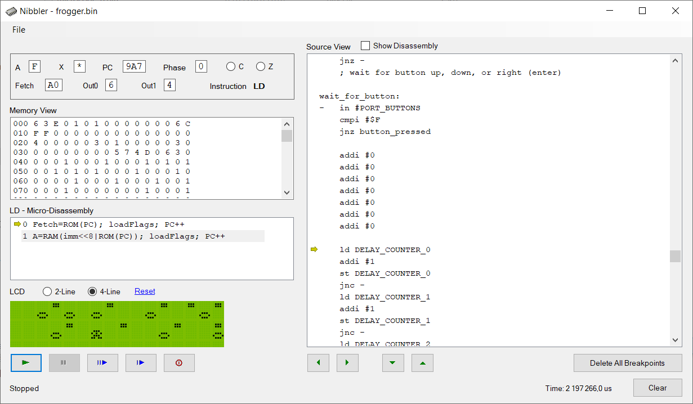

This project is a modernized version of simulator for the [Nibbler project](https://www.bigmessowires.com/nibbler/) — a 4-bit CPU on a breadboard.

I have translated it from C++/CLI to C# and added a 1602-display emulator from [vrEmuLcd](https://github.com/visrealm/vrEmuLcd) project.

**How to build**

1. Get a VisualStudio
2. Clone this repo
3. Open Nibbler-Simulator.sln
4. Press \[F5\] 
